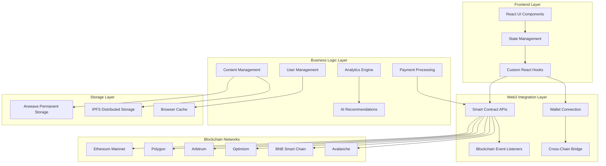

# Design Document

## Overview

The LibertyX blockchain integration transforms the platform into a fully decentralized, cryptocurrency-native content platform. This design implements a comprehensive Web3 architecture that eliminates all fiat currency dependencies while providing award-winning user experience through advanced features like AI recommendations, cross-chain bridging, and enterprise-grade security.

The system architecture follows a modular approach with clear separation between blockchain interactions, UI components, and business logic. All pricing and transactions operate exclusively in cryptocurrency, with the platform's native LIB token serving as the primary medium of exchange.

## Architecture

### High-Level Architecture



### Component Architecture

The frontend follows a component-based architecture with the following structure:

- **Core Components**: Reusable UI components with Tailwind CSS styling
- **Web3 Components**: Blockchain-specific components for wallet connection and transactions
- **Business Components**: Feature-specific components for content, creators, and payments
- **Layout Components**: Navigation, headers, and page structure components

## Components and Interfaces

### Web3 Integration Components

#### WalletProvider
```typescript
interface WalletContextType {
  account: string | null;
  chainId: number | null;
  balance: TokenBalance[];
  isConnected: boolean;
  isConnecting: boolean;
  connect: (walletType: WalletType) => Promise<void>;
  disconnect: () => void;
  switchNetwork: (chainId: number) => Promise<void>;
  signMessage: (message: string) => Promise<string>;
}
```

#### ContractManager
```typescript
interface ContractManager {
  contracts: {
    libertyToken: Contract;
    creatorRegistry: Contract;
    contentRegistry: Contract;
    revenueSplitter: Contract;
    subscriptionManager: Contract;
    nftAccess: Contract;
    libertyDAO: Contract;
  };
  getContract: (name: string, chainId: number) => Contract;
  executeTransaction: (contractName: string, method: string, params: any[]) => Promise<TransactionResult>;
  listenToEvents: (contractName: string, eventName: string, callback: Function) => void;
}
```

### Content Management Components

#### ContentCard (Enhanced)
```typescript
interface ContentCardProps {
  item: ContentCardData;
  onNavigate: (page: Page) => void;
  showCryptoPrice: boolean;
  priceToken: 'LIB' | 'ETH' | 'MATIC' | 'BNB';
  enableAIRecommendations: boolean;
}

interface ContentCardData {
  id: number;
  creatorAddress: string;
  creatorName: string;
  creatorAvatar: string;
  thumbnail: string;
  arweaveId: string;
  price: {
    amount: number;
    token: string;
    decimals: number;
  };
  likes: number;
  views: number;
  isVerified: boolean;
  isHD: boolean;
  isVR: boolean;
  category: string;
  tags: string[];
  accessLevel: 'public' | 'subscription' | 'nft' | 'premium';
  nftTierRequired?: number;
}
```

#### PriceDisplay Component
```typescript
interface PriceDisplayProps {
  price: {
    amount: number;
    token: string;
    decimals: number;
  };
  size: 'small' | 'medium' | 'large';
  showIcon: boolean;
  animate: boolean;
}
```

### Analytics and AI Components

#### AnalyticsDashboard
```typescript
interface AnalyticsData {
  earnings: {
    total: TokenAmount[];
    daily: ChartData[];
    monthly: ChartData[];
  };
  viewership: {
    totalViews: number;
    uniqueViewers: number;
    averageWatchTime: number;
    demographics: DemographicData[];
  };
  engagement: {
    likes: number;
    comments: number;
    shares: number;
    subscriptions: number;
  };
  predictions: {
    nextMonthEarnings: TokenAmount[];
    growthRate: number;
    trendingScore: number;
  };
}
```

#### AIRecommendationEngine
```typescript
interface RecommendationEngine {
  getUserPreferences: (userAddress: string) => Promise<UserPreferences>;
  getRecommendations: (userAddress: string, limit: number) => Promise<ContentCardData[]>;
  updateUserInteraction: (userAddress: string, contentId: number, interaction: InteractionType) => void;
  getTrendingContent: (timeframe: string) => Promise<ContentCardData[]>;
  getCategoryRecommendations: (category: string) => Promise<ContentCardData[]>;
}
```

### Cross-Chain Bridge Components

#### BridgeInterface
```typescript
interface BridgeTransaction {
  id: string;
  sourceChain: number;
  destinationChain: number;
  token: string;
  amount: string;
  status: 'pending' | 'confirmed' | 'completed' | 'failed';
  txHash: string;
  estimatedTime: number;
  fees: TokenAmount;
}

interface BridgeManager {
  getSupportedChains: () => ChainInfo[];
  estimateBridgeFee: (sourceChain: number, destChain: number, token: string, amount: string) => Promise<TokenAmount>;
  initiateBridge: (transaction: BridgeTransaction) => Promise<string>;
  trackBridgeStatus: (transactionId: string) => Promise<BridgeTransaction>;
  getBridgeHistory: (userAddress: string) => Promise<BridgeTransaction[]>;
}
```

## Data Models

### Enhanced Token and Pricing Models

```typescript
interface TokenAmount {
  amount: string; // Using string to handle large numbers and decimals
  token: string;
  decimals: number;
  symbol: string;
  icon?: string;
}

interface PriceRange {
  min: TokenAmount;
  max: TokenAmount;
  token: string;
}

interface CryptoPricing {
  basePrice: TokenAmount;
  subscriptionPrice?: TokenAmount;
  nftTierPrices?: TokenAmount[];
  discounts?: {
    bulkPurchase: number;
    loyaltyMember: number;
    earlyAccess: number;
  };
}
```

### User and Creator Models

```typescript
interface User {
  address: string;
  ens?: string;
  avatar?: string;
  bio?: string;
  isCreator: boolean;
  isVerified: boolean;
  joinDate: number;
  preferences: UserPreferences;
  subscriptions: Subscription[];
  nftHoldings: NFTHolding[];
  loyaltyLevel: number;
  achievements: Achievement[];
}

interface Creator extends User {
  handle: string;
  kycStatus: 'pending' | 'verified' | 'rejected';
  earnings: {
    total: TokenAmount[];
    available: TokenAmount[];
    pending: TokenAmount[];
  };
  analytics: AnalyticsData;
  subscriptionPlans: SubscriptionPlan[];
  nftTiers: NFTTier[];
  contentCount: number;
  followerCount: number;
}
```

### Content and Media Models

```typescript
interface Content {
  id: number;
  creatorAddress: string;
  title: string;
  description: string;
  arweaveId: string;
  ipfsHash?: string;
  thumbnail: string;
  duration: number;
  fileSize: number;
  format: string;
  resolution: string;
  pricing: CryptoPricing;
  accessLevel: AccessLevel;
  tags: string[];
  category: string;
  uploadDate: number;
  isEncrypted: boolean;
  viewCount: number;
  likeCount: number;
  commentCount: number;
  aiTags: string[];
  contentRating: string;
}

interface AccessLevel {
  type: 'public' | 'subscription' | 'nft' | 'premium';
  requirements?: {
    subscriptionTier?: number;
    nftTierRequired?: number;
    minimumStake?: TokenAmount;
    whitelistOnly?: boolean;
  };
}
```

## Error Handling

### Comprehensive Error Management System

```typescript
interface ErrorHandler {
  handleWalletError: (error: WalletError) => UserFriendlyError;
  handleContractError: (error: ContractError) => UserFriendlyError;
  handleNetworkError: (error: NetworkError) => UserFriendlyError;
  handleBridgeError: (error: BridgeError) => UserFriendlyError;
  handleStorageError: (error: StorageError) => UserFriendlyError;
}

interface UserFriendlyError {
  title: string;
  message: string;
  actionable: boolean;
  suggestedActions?: string[];
  supportLink?: string;
  retryable: boolean;
}
```

### Error Recovery Strategies

1. **Transaction Failures**: Automatic retry with adjusted gas prices
2. **Network Issues**: Fallback to alternative RPC endpoints
3. **Storage Failures**: Retry with exponential backoff
4. **Bridge Failures**: Provide recovery tools and support contact
5. **Wallet Disconnections**: Automatic reconnection attempts

## Testing Strategy

### Unit Testing
- **Component Testing**: Test all React components with crypto pricing
- **Hook Testing**: Test custom Web3 hooks and state management
- **Service Testing**: Test blockchain interaction services
- **Utility Testing**: Test crypto conversion and formatting utilities

### Integration Testing
- **Wallet Integration**: Test all supported wallet connections
- **Contract Integration**: Test smart contract interactions
- **Cross-Chain Testing**: Test bridge functionality across networks
- **Storage Integration**: Test Arweave and IPFS uploads

### End-to-End Testing
- **User Flows**: Complete user journeys from wallet connection to content purchase
- **Creator Flows**: Content upload, pricing, and earnings withdrawal
- **Payment Flows**: Subscription purchases and NFT minting
- **Bridge Flows**: Cross-chain asset transfers

### Performance Testing
- **Load Testing**: High concurrent user scenarios
- **Blockchain Performance**: Transaction throughput and gas optimization
- **Storage Performance**: Large file upload and retrieval
- **AI Performance**: Recommendation engine response times

## Security Considerations

### Smart Contract Security
- **Reentrancy Protection**: All contract interactions use proper guards
- **Access Control**: Role-based permissions for administrative functions
- **Upgrade Safety**: Proxy patterns for contract upgrades
- **Audit Requirements**: Third-party security audits before mainnet deployment

### Frontend Security
- **Input Validation**: All user inputs sanitized and validated
- **XSS Protection**: Content Security Policy and input encoding
- **Wallet Security**: Secure key management and transaction signing
- **Privacy Protection**: Zero-knowledge proofs for sensitive operations

### Data Security
- **Encryption**: End-to-end encryption for premium content
- **Key Management**: Secure storage of encryption keys
- **Access Control**: Blockchain-based access verification
- **Audit Trails**: Immutable logs of all access and transactions

## Performance Optimization

### Frontend Optimization
- **Code Splitting**: Lazy loading of components and routes
- **Image Optimization**: Progressive loading and WebP format
- **Caching Strategy**: Intelligent caching of blockchain data
- **Bundle Optimization**: Tree shaking and minification

### Blockchain Optimization
- **Gas Optimization**: Efficient contract calls and batching
- **Event Filtering**: Optimized event listening and processing
- **RPC Management**: Load balancing across multiple providers
- **Transaction Queuing**: Smart transaction ordering and timing

### Storage Optimization
- **Content Delivery**: CDN integration for Arweave content
- **Compression**: Efficient file compression before upload
- **Caching**: Multi-layer caching strategy
- **Prefetching**: Predictive content loading

## Deployment Strategy

### Environment Configuration
- **Development**: Local blockchain and test networks
- **Staging**: Testnet deployment with full feature testing
- **Production**: Mainnet deployment with gradual rollout

### Monitoring and Analytics
- **Performance Monitoring**: Real-time application performance
- **Blockchain Monitoring**: Transaction success rates and gas usage
- **User Analytics**: Privacy-preserving usage analytics
- **Error Tracking**: Comprehensive error logging and alerting

### Scaling Strategy
- **Horizontal Scaling**: Load balancing across multiple instances
- **Database Scaling**: Distributed storage solutions
- **CDN Integration**: Global content delivery network
- **Microservices**: Service-oriented architecture for scalability