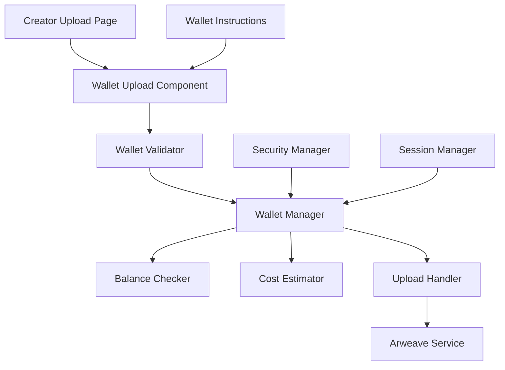

# Design Document

## Overview

This design implements a secure, user-friendly system for creators to upload and use their own Arweave wallets for content uploads. The solution prioritizes security by keeping wallet data in memory only, while providing clear guidance for wallet setup and funding.

## Architecture



## Components and Interfaces

### WalletUploadComponent
- **Purpose**: Handle wallet file upload and validation
- **Props**: `onWalletLoaded(wallet)`, `onError(error)`
- **State**: `dragActive`, `isValidating`, `error`
- **Methods**: `handleFileUpload()`, `validateWallet()`, `clearWallet()`

### WalletManager (Hook)
- **Purpose**: Manage wallet state and operations
- **State**: `wallet`, `balance`, `isLoaded`, `error`
- **Methods**: `loadWallet()`, `getBalance()`, `clearWallet()`, `estimateCost()`

### ArweaveWalletService
- **Purpose**: Wallet operations and validation
- **Methods**: 
  - `validateWalletFile(file)` - Validate JSON structure
  - `getWalletBalance(wallet)` - Check AR balance
  - `estimateUploadCost(fileSize)` - Calculate upload cost
  - `uploadWithWallet(file, wallet, metadata)` - Upload using creator's wallet

### WalletInstructions
- **Purpose**: Guide creators through wallet setup
- **Sections**: Wallet creation, funding options, troubleshooting
- **Interactive**: Links to ArConnect, funding exchanges

## Data Models

### WalletData
```typescript
interface WalletData {
  address: string;
  balance: string; // AR balance
  isValid: boolean;
  keyfile: any; // JWK format
}
```

### UploadCostEstimate
```typescript
interface UploadCostEstimate {
  fileSize: number;
  estimatedCost: string; // in AR
  hasSufficientFunds: boolean;
  recommendedFunding?: string;
}
```

## Error Handling

### Wallet Validation Errors
- Invalid JSON format
- Missing required JWK fields
- Corrupted wallet file
- Network connection issues

### Balance/Funding Errors
- Insufficient funds
- Balance check failures
- Network timeouts
- Invalid wallet address

### Upload Errors
- Transaction signing failures
- Network upload errors
- Arweave network issues
- File size limitations

## Testing Strategy

### Unit Tests
- Wallet file validation
- Balance checking logic
- Cost estimation accuracy
- Error handling scenarios

### Integration Tests
- Complete upload flow with creator wallet
- Wallet switching between uploads
- Session management and cleanup
- Error recovery scenarios

### User Experience Tests
- Wallet setup instructions clarity
- Upload cost transparency
- Error message helpfulness
- Mobile responsiveness

## Security Considerations

### Wallet Data Protection
- Store wallet only in component state (memory)
- Never persist to localStorage or sessionStorage
- Clear wallet data on component unmount
- Implement automatic session timeout

### Private Key Handling
- Never log or display private key data
- Use wallet only for transaction signing
- Implement secure memory cleanup
- Validate wallet integrity before use

### Network Security
- Use HTTPS for all Arweave communications
- Validate transaction responses
- Implement retry logic with exponential backoff
- Handle network failures gracefully