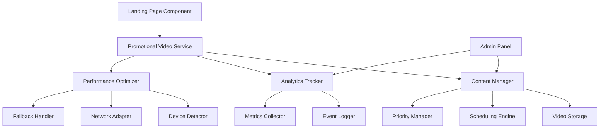

# Design Document

## Overview

The Product Advertisement System is designed to replace the current generic background video on the LibertyX landing page with a sophisticated content management system for promotional videos. The system will provide administrators with full control over promotional content while delivering optimized viewing experiences across all devices and network conditions.

The architecture follows a modular approach with clear separation between content management, display logic, analytics tracking, and performance optimization. The system integrates seamlessly with the existing React/TypeScript codebase and maintains the current visual design while enhancing functionality.

## Architecture

### High-Level Architecture



### Component Architecture

The system consists of three main layers:

1. **Presentation Layer**: React components for both user-facing display and admin management
2. **Service Layer**: Business logic for content management, analytics, and optimization
3. **Data Layer**: Storage and retrieval of promotional content and analytics data

## Components and Interfaces

### Core Data Models

```typescript
interface PromotionalVideo {
  id: string;
  title: string;
  description: string;
  videoUrl: string;
  thumbnailUrl: string;
  fileSize: number;
  duration: number;
  format: 'mp4' | 'webm';
  isActive: boolean;
  priority: number;
  createdAt: Date;
  updatedAt: Date;
  schedule?: VideoSchedule;
  analytics: VideoAnalytics;
}

interface VideoSchedule {
  startDate: Date;
  endDate: Date;
  timezone: string;
  isRecurring: boolean;
  recurringPattern?: RecurringPattern;
}

interface RecurringPattern {
  type: 'daily' | 'weekly' | 'monthly';
  interval: number;
  daysOfWeek?: number[];
}

interface VideoAnalytics {
  impressions: number;
  completionRate: number;
  clickThroughRate: number;
  averageViewTime: number;
  deviceBreakdown: DeviceStats;
  performanceScore: number;
}

interface DeviceStats {
  desktop: number;
  mobile: number;
  tablet: number;
}
```

### Service Interfaces

```typescript
interface PromotionalVideoService {
  getCurrentVideo(): Promise<PromotionalVideo | null>;
  getActiveVideos(): Promise<PromotionalVideo[]>;
  uploadVideo(file: File, metadata: VideoMetadata): Promise<PromotionalVideo>;
  updateVideo(id: string, updates: Partial<PromotionalVideo>): Promise<PromotionalVideo>;
  deleteVideo(id: string): Promise<void>;
  toggleVideoStatus(id: string, isActive: boolean): Promise<void>;
}

interface AnalyticsService {
  trackImpression(videoId: string, deviceType: string): Promise<void>;
  trackInteraction(videoId: string, interactionType: string): Promise<void>;
  getVideoAnalytics(videoId: string, dateRange: DateRange): Promise<VideoAnalytics>;
  exportAnalytics(format: 'csv' | 'json'): Promise<Blob>;
}

interface PerformanceService {
  getOptimizedVideoUrl(videoId: string, deviceType: string): string;
  preloadNextVideo(): Promise<void>;
  handleVideoError(error: VideoError): Promise<string>; // Returns fallback URL
}
```

### React Components

#### PromotionalVideoBackground Component
- Replaces current video background in LandingPage
- Handles video loading, playback, and error states
- Implements progressive loading and fallback mechanisms
- Tracks analytics events

#### AdminVideoManager Component
- Provides upload interface with drag-and-drop support
- Displays video list with metadata and controls
- Handles scheduling and priority management
- Shows real-time analytics dashboard

#### VideoScheduler Component
- Calendar-based scheduling interface
- Timezone support and recurring pattern configuration
- Conflict resolution and priority override settings

## Data Models

### Storage Strategy

The system uses a hybrid storage approach:

1. **Video Files**: Stored in cloud storage (AWS S3 or similar) with CDN distribution
2. **Metadata**: Stored in local database (IndexedDB for client-side caching)
3. **Analytics**: Time-series data stored in analytics database
4. **Configuration**: Admin settings stored in application database

### Database Schema

```sql
-- Promotional Videos Table
CREATE TABLE promotional_videos (
  id VARCHAR(36) PRIMARY KEY,
  title VARCHAR(255) NOT NULL,
  description TEXT,
  video_url VARCHAR(500) NOT NULL,
  thumbnail_url VARCHAR(500),
  file_size BIGINT,
  duration INTEGER,
  format VARCHAR(10),
  is_active BOOLEAN DEFAULT true,
  priority INTEGER DEFAULT 0,
  created_at TIMESTAMP DEFAULT CURRENT_TIMESTAMP,
  updated_at TIMESTAMP DEFAULT CURRENT_TIMESTAMP
);

-- Video Schedules Table
CREATE TABLE video_schedules (
  id VARCHAR(36) PRIMARY KEY,
  video_id VARCHAR(36) REFERENCES promotional_videos(id),
  start_date TIMESTAMP,
  end_date TIMESTAMP,
  timezone VARCHAR(50),
  is_recurring BOOLEAN DEFAULT false,
  recurring_pattern JSON
);

-- Video Analytics Table
CREATE TABLE video_analytics (
  id VARCHAR(36) PRIMARY KEY,
  video_id VARCHAR(36) REFERENCES promotional_videos(id),
  event_type VARCHAR(50),
  device_type VARCHAR(20),
  timestamp TIMESTAMP DEFAULT CURRENT_TIMESTAMP,
  session_id VARCHAR(36),
  additional_data JSON
);
```

## Error Handling

### Error Types and Recovery Strategies

1. **Video Loading Errors**
   - Network timeout: Retry with exponential backoff
   - File not found: Switch to fallback video or static image
   - Format not supported: Serve alternative format

2. **Upload Errors**
   - File too large: Show compression options
   - Invalid format: Display supported formats
   - Storage quota exceeded: Alert administrator

3. **Scheduling Conflicts**
   - Overlapping schedules: Show conflict resolution interface
   - Invalid date ranges: Validate and suggest corrections
   - Timezone issues: Convert to user's local timezone

### Fallback Mechanisms

```typescript
const FALLBACK_STRATEGY = {
  primary: 'current_promotional_video',
  secondary: 'default_promotional_video',
  tertiary: 'static_branded_background',
  emergency: 'solid_color_background'
};
```

## Testing Strategy

### Unit Testing
- Service layer functions with mocked dependencies
- Component rendering with various props and states
- Utility functions for video processing and analytics
- Error handling scenarios and edge cases

### Integration Testing
- Video upload and storage workflow
- Analytics tracking and data collection
- Scheduling system with time-based scenarios
- Performance optimization under different network conditions

### End-to-End Testing
- Complete admin workflow from upload to display
- User experience across different devices and browsers
- Performance testing with various video sizes and formats
- Accessibility testing for video controls and alternatives

### Performance Testing
- Video loading times across different network speeds
- Memory usage during video playback
- CDN performance and cache effectiveness
- Mobile device battery impact

### Test Scenarios

1. **Happy Path Testing**
   - Upload video → Set schedule → Display on landing page
   - Multiple videos with priority rotation
   - Analytics collection and reporting

2. **Error Scenario Testing**
   - Network failures during video loading
   - Corrupted video files
   - Storage quota exceeded
   - Invalid scheduling configurations

3. **Performance Testing**
   - Large video file handling
   - Concurrent user access
   - Mobile device optimization
   - Slow network conditions

4. **Security Testing**
   - File upload validation
   - Access control for admin functions
   - Data sanitization for analytics
   - CORS and content security policies

### Testing Tools and Framework

- **Unit Tests**: Jest with React Testing Library
- **Integration Tests**: Cypress for component integration
- **E2E Tests**: Playwright for cross-browser testing
- **Performance Tests**: Lighthouse CI for performance metrics
- **Load Testing**: Artillery for concurrent user simulation