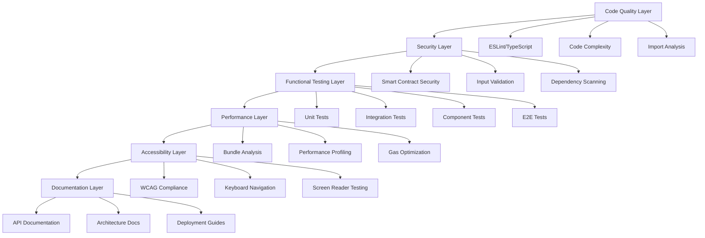
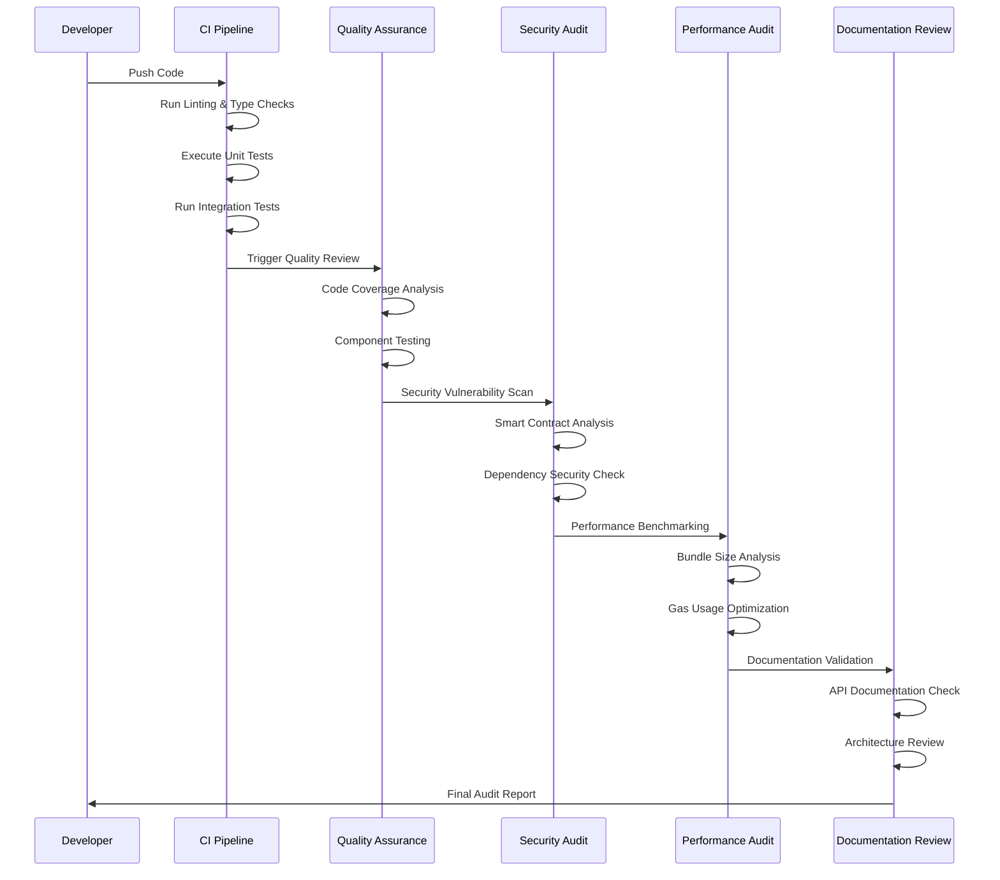

# Testing and Audit Design Document

## Overview

This design document outlines a comprehensive testing and auditing strategy for the LibertyX decentralized content platform. The approach focuses on ensuring production-ready code quality, security, performance, and maintainability before public GitHub release. The design leverages existing Vitest infrastructure and builds upon the extensive test suite already in place.

## Architecture

### Testing Architecture



### Audit Pipeline



## Components and Interfaces

### 1. Code Quality Analyzer

**Purpose**: Ensures consistent code standards and best practices

**Interface**:
```typescript
interface CodeQualityAnalyzer {
  analyzeTypeScript(): Promise<TypeScriptAnalysisResult>;
  runESLint(): Promise<ESLintResult>;
  checkComplexity(): Promise<ComplexityReport>;
  validateImports(): Promise<ImportAnalysisResult>;
  generateQualityReport(): Promise<QualityReport>;
}

interface QualityReport {
  typeScriptErrors: TypeScriptError[];
  lintingIssues: LintingIssue[];
  complexityViolations: ComplexityViolation[];
  unusedImports: UnusedImport[];
  overallScore: number;
  recommendations: string[];
}
```

### 2. Security Auditor

**Purpose**: Identifies and reports security vulnerabilities

**Interface**:
```typescript
interface SecurityAuditor {
  scanSmartContracts(): Promise<ContractSecurityReport>;
  validateInputSanitization(): Promise<InputValidationReport>;
  checkDependencyVulnerabilities(): Promise<DependencySecurityReport>;
  auditPrivateKeyHandling(): Promise<PrivateKeyAuditReport>;
  generateSecurityReport(): Promise<SecurityReport>;
}

interface SecurityReport {
  contractVulnerabilities: ContractVulnerability[];
  inputValidationIssues: ValidationIssue[];
  dependencyVulnerabilities: DependencyVulnerability[];
  privateKeyExposures: PrivateKeyExposure[];
  riskLevel: 'LOW' | 'MEDIUM' | 'HIGH' | 'CRITICAL';
  mitigationSteps: string[];
}
```

### 3. Test Coverage Analyzer

**Purpose**: Ensures comprehensive test coverage across all layers

**Interface**:
```typescript
interface TestCoverageAnalyzer {
  runUnitTests(): Promise<UnitTestResult>;
  executeIntegrationTests(): Promise<IntegrationTestResult>;
  performComponentTests(): Promise<ComponentTestResult>;
  runE2ETests(): Promise<E2ETestResult>;
  generateCoverageReport(): Promise<CoverageReport>;
}

interface CoverageReport {
  unitTestCoverage: number;
  integrationTestCoverage: number;
  componentTestCoverage: number;
  e2eTestCoverage: number;
  overallCoverage: number;
  uncoveredFiles: string[];
  criticalPathsCovered: boolean;
}
```

### 4. Performance Profiler

**Purpose**: Analyzes and optimizes application performance

**Interface**:
```typescript
interface PerformanceProfiler {
  analyzeBundleSize(): Promise<BundleSizeReport>;
  profilePageLoadTimes(): Promise<LoadTimeReport>;
  optimizeGasUsage(): Promise<GasOptimizationReport>;
  detectMemoryLeaks(): Promise<MemoryLeakReport>;
  generatePerformanceReport(): Promise<PerformanceReport>;
}

interface PerformanceReport {
  bundleSize: BundleSizeMetrics;
  loadTimes: LoadTimeMetrics;
  gasUsage: GasUsageMetrics;
  memoryUsage: MemoryUsageMetrics;
  optimizationRecommendations: string[];
}
```

### 5. Accessibility Validator

**Purpose**: Ensures WCAG 2.1 AA compliance and usability

**Interface**:
```typescript
interface AccessibilityValidator {
  validateWCAGCompliance(): Promise<WCAGComplianceReport>;
  testKeyboardNavigation(): Promise<KeyboardNavigationReport>;
  auditScreenReaderCompatibility(): Promise<ScreenReaderReport>;
  checkColorContrast(): Promise<ColorContrastReport>;
  generateAccessibilityReport(): Promise<AccessibilityReport>;
}

interface AccessibilityReport {
  wcagViolations: WCAGViolation[];
  keyboardNavigationIssues: KeyboardIssue[];
  screenReaderIssues: ScreenReaderIssue[];
  colorContrastFailures: ColorContrastFailure[];
  complianceLevel: 'A' | 'AA' | 'AAA' | 'NON_COMPLIANT';
  remediationSteps: string[];
}
```

### 6. Documentation Auditor

**Purpose**: Validates documentation completeness and accuracy

**Interface**:
```typescript
interface DocumentationAuditor {
  validateAPIDocumentation(): Promise<APIDocumentationReport>;
  checkArchitectureDocumentation(): Promise<ArchitectureDocReport>;
  auditDeploymentInstructions(): Promise<DeploymentDocReport>;
  validateCodeComments(): Promise<CodeCommentReport>;
  generateDocumentationReport(): Promise<DocumentationReport>;
}

interface DocumentationReport {
  apiDocumentationCoverage: number;
  architectureDocumentationComplete: boolean;
  deploymentInstructionsValid: boolean;
  codeCommentCoverage: number;
  missingDocumentation: string[];
  documentationQualityScore: number;
}
```

## Data Models

### Audit Configuration

```typescript
interface AuditConfiguration {
  codeQuality: {
    enableTypeScriptCheck: boolean;
    enableESLint: boolean;
    maxComplexity: number;
    maxFunctionLength: number;
  };
  security: {
    enableContractAudit: boolean;
    enableDependencyScan: boolean;
    enableInputValidation: boolean;
    riskThreshold: 'LOW' | 'MEDIUM' | 'HIGH';
  };
  testing: {
    minCoverageThreshold: number;
    enableUnitTests: boolean;
    enableIntegrationTests: boolean;
    enableE2ETests: boolean;
  };
  performance: {
    maxBundleSize: number;
    maxLoadTime: number;
    enableGasOptimization: boolean;
  };
  accessibility: {
    wcagLevel: 'A' | 'AA' | 'AAA';
    enableKeyboardTesting: boolean;
    enableScreenReaderTesting: boolean;
  };
  documentation: {
    minAPIDocCoverage: number;
    requireArchitectureDocs: boolean;
    requireDeploymentDocs: boolean;
  };
}
```

### Comprehensive Audit Report

```typescript
interface ComprehensiveAuditReport {
  timestamp: Date;
  projectVersion: string;
  auditConfiguration: AuditConfiguration;
  
  codeQualityReport: QualityReport;
  securityReport: SecurityReport;
  coverageReport: CoverageReport;
  performanceReport: PerformanceReport;
  accessibilityReport: AccessibilityReport;
  documentationReport: DocumentationReport;
  
  overallScore: number;
  readinessLevel: 'NOT_READY' | 'NEEDS_WORK' | 'READY' | 'PRODUCTION_READY';
  criticalIssues: CriticalIssue[];
  recommendations: Recommendation[];
  nextSteps: string[];
}
```

## Error Handling

### Audit Error Management

```typescript
class AuditError extends Error {
  constructor(
    message: string,
    public category: 'CODE_QUALITY' | 'SECURITY' | 'TESTING' | 'PERFORMANCE' | 'ACCESSIBILITY' | 'DOCUMENTATION',
    public severity: 'LOW' | 'MEDIUM' | 'HIGH' | 'CRITICAL',
    public remediation?: string
  ) {
    super(message);
    this.name = 'AuditError';
  }
}

interface ErrorHandler {
  handleAuditError(error: AuditError): Promise<void>;
  logAuditFailure(category: string, details: any): Promise<void>;
  generateErrorReport(): Promise<ErrorReport>;
}
```

### Graceful Degradation

- If specific audit tools fail, continue with remaining audits
- Provide partial reports when complete audit cannot be performed
- Log all failures for manual review
- Offer alternative audit methods when primary tools are unavailable

## Testing Strategy

### Test Execution Flow

1. **Pre-Audit Setup**
   - Validate environment configuration
   - Install required audit tools
   - Prepare test data and mocks

2. **Code Quality Phase**
   - Run TypeScript compiler checks
   - Execute ESLint with strict rules
   - Analyze code complexity metrics
   - Validate import usage

3. **Security Audit Phase**
   - Scan smart contracts for vulnerabilities
   - Validate input sanitization
   - Check dependency security
   - Audit private key handling

4. **Functional Testing Phase**
   - Execute unit test suite
   - Run integration tests
   - Perform component testing
   - Execute end-to-end tests

5. **Performance Analysis Phase**
   - Analyze bundle sizes
   - Profile page load times
   - Optimize gas usage
   - Detect memory leaks

6. **Accessibility Testing Phase**
   - Validate WCAG compliance
   - Test keyboard navigation
   - Audit screen reader compatibility
   - Check color contrast

7. **Documentation Review Phase**
   - Validate API documentation
   - Review architecture documentation
   - Audit deployment instructions
   - Check code comment coverage

### Test Data Management

- Use consistent test data across all audit phases
- Mock external dependencies for reliable testing
- Maintain separate test environments for different audit types
- Ensure test data privacy and security

### Continuous Integration Integration

- Integrate audit pipeline with existing CI/CD
- Fail builds on critical security or quality issues
- Generate audit reports for each commit
- Track audit metrics over time

## Implementation Considerations

### Tool Selection

- **ESLint**: Code quality and style enforcement
- **TypeScript Compiler**: Type safety validation
- **Vitest**: Unit and integration testing
- **@testing-library/react**: Component testing
- **axe-core**: Accessibility testing
- **webpack-bundle-analyzer**: Bundle size analysis
- **npm audit**: Dependency vulnerability scanning

### Performance Optimization

- Run audits in parallel where possible
- Cache audit results for unchanged files
- Use incremental analysis for large codebases
- Optimize test execution order

### Reporting and Visualization

- Generate HTML reports with interactive charts
- Provide JSON output for programmatic consumption
- Create executive summaries for stakeholders
- Track metrics over time with trend analysis

### Scalability Considerations

- Design for large codebases with thousands of files
- Support distributed audit execution
- Handle multiple project configurations
- Provide audit result aggregation across projects